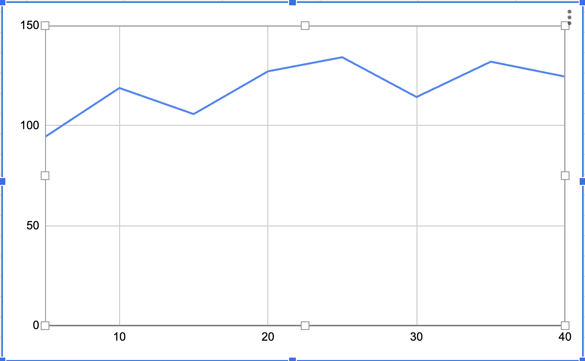
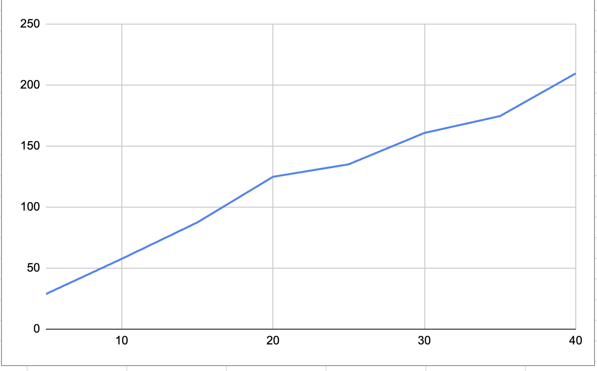

## Комп'ютерні системи імітаційного моделювання
## СПм-22-4, **Кононенко Олександр Миколайович**
### Лабораторна робота №**1**. Опис імітаційних моделей та проведення обчислювальних експериментів

 

### Варіант 13, модель у середовищі NetLogo:
[Fruit Wars](http://www.netlogoweb.org/launch#http://www.netlogoweb.org/assets/modelslib/Sample%20Models/Social%20Science/Economics/Fruit%20Wars.nlogo)

 

### Вербальний опис моделі:
Ця модель демонструє, як економічне середовище з ненульовою сумою може стимулювати співпрацю та перешкоджати насильству. Збирачі блукають картою у пошуках фруктових кущів. Коли вони досягають фруктового куща, вони отримують енергію, видобуваючи їжу, доки у фруктовому кущі не закінчаться ресурси. Ці тварини розмножуються та передають свої характеристики потомству, накопичивши певну кількість енергії. Вони також приймають рішення на основі спадкових параметрів про те, як взаємодіяти з іншими тваринами-збирачами. Збирачі можуть співпрацювати, загрожувати, боротися чи бігти за різних обставин.

### Керуючі параметри:
- **FRUIT-BUSHES** визначає кількість плодових кущів на початку.
- **FORAGERS** визначає кількість збирачів на початку.

### Внутрішні параметри:
- **TICKS-TO-FLEE**.Коли збиратель тікає, це кількість галочок, на які він повинен случайно переміститися, перш ніж знайти новий кущ .
- **BUSH-GROWTH-CHANCE**.Можливість виростити новий кущ на кожному кроці .
- **RATE-OF-MUTATION**. Ймовірність того, що окремий біт зміниться за час проходження бітового генома від батька до нащадка.
- **COLLABORATION-BONUS**. Фактор використовуваний для визначення швидкості спільного пошуку їди.
- **MAX-AGE**. Максимальна кількість галочок, які може прожити окремий збиратель.

### Показники роботи системи:
- максимальна швидкість на поточному такті симуляції, тобто, швидкість найшвидшої на даний момент машини на трасі. Не може перевищувати значення speed-limit.
- найменша швидкість на поточному такті, тобто, швидкість найповільнішої в даний момент машини.
- поточна швидкість машини, що відстежується (червона машина).

### Примітки:
При налаштуваннях керуючих параметрів за замовчуванням, найкращий коефіцієнт популяції.

### Недоліки моделі:
При мінімальних показниках швидкості мутації показник середньої популяції швидко збільшується

 

## Обчислювальні експерименти
### 1. Вплив кількості збирачів на середню популяцію.
Досліджується залежність середньої популяції від збирачів, зазначеного на початку симуляції.
Експерименти проводяться при 5-40 збирачів, з кроком 5, усього 8 симуляцій.  
Інші керуючі параметри мають значення за замовчуванням:
- **FRUIT-BUSHES**: 40
- **TICKS-TO-FLEE**: 49
- **RATE-OF-MUTATION**. 1
- **COLLABORATION-BONUS**. 5
- **MAX-AGE**. 500
- **BUSH-GROWTH-CHANCE**. 6

<table>
<thead>
<tr><th>Кількість збирачів</th><th>Середня популяція збирачів</th></tr>
</thead>
<tbody>
<tr><td>5</td><td>94,412</td></tr>
<tr><td>10</td><td>118,844</td></tr>
<tr><td>15</td><td>105,803</td></tr>
<tr><td>20</td><td>127,187</td></tr>
<tr><td>25</td><td>134,221</td></tr>
<tr><td>30</td><td>114,339</td></tr>
<tr><td>35</td><td>132,002</td></tr>
<tr><td>40</td><td>124,549</td></tr>
</tbody>
</table>

Графік наочно показує, зі збільшенням збирачів, їх середня популяція збільшувалась.

### 2. Вплив максималької кіьлкості галочок на середню популяцію.
Досліджуеться залежність середньої популяції збирачів від кількості галочок, які може прожити окремий збирач. Есперименти проводяться при 50-300 галочок, з кроком 50, усього симуляцій 6.
Інші керуючі параметри мають значення за замовчуванням:
- **FRUIT-BUSHES**: 40
- **TICKS-TO-FLEE**: 49
- **RATE-OF-MUTATION**. 1
- **COLLABORATION-BONUS**. 5
- **FORAGERS**. 40
- **BUSH-GROWTH-CHANCE**. 6

<table>
<thead>
<tr><th>Кількість галочок</th><th>Середня популяція збирачів</th></tr>
</thead>
<tbody>
<tr><td>50</td><td>40</td></tr>
<tr><td>100</td><td>42,607</td></tr>
<tr><td>150</td><td>126,151</td></tr>
<tr><td>200</td><td>80,909</td></tr>
<tr><td>250</td><td>166,426</td></tr>
<tr><td>300</td><td>130,459</td></tr>
</tbody>
</table>

Графік наочно показує, зі збільшенням галочок, їх середня популяція збільшувалась.

### 3. Вплив шансу зростання куща на середню популяцію при мінімальних показниках "Швидкість мутації" та "Бонус за співпрацю"
Досліджуеться залежність середньої популяції збирачів від шансу зростання куща. Есперименти проводяться від 5 - 40 шансу зростання куща, з кроком 5, усього симуляцій 8.

- **FRUIT-BUSHES**: 40
- **TICKS-TO-FLEE**: 49
- **RATE-OF-MUTATION**. 0,1
- **COLLABORATION-BONUS**. 0,1
- **FORAGERS**. 40
- **MAX-AGE**. 500

<table>
<thead>
<tr><th>Шанс зростання куща</th><th>Середня популяція збирачів</th></tr>
</thead>
<tbody>
<tr><td>5</td><td>28,786</td></tr>
<tr><td>10</td><td>57,591</td></tr>
<tr><td>15</td><td>87,461</td></tr>
<tr><td>20</td><td>124,873</td></tr>
<tr><td>25</td><td>135,108</td></tr>
<tr><td>30</td><td>160,816</td></tr>
<tr><td>35</td><td>174,65</td></tr>
<tr><td>40</td><td>209,636</td></tr>
</tbody>
</table>

Графік наочно показує, зі збільшенням шансу зростання куща, їх середня популяція збільшувалась.
